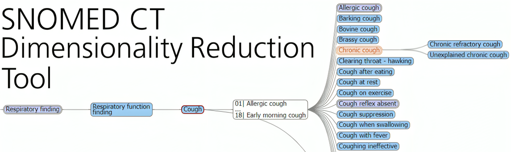

<p align="center">
  
</p>

## Purpose
This code is designed to facilitate the selection of optimal SNOMED concepts for the prediction of class labels. Selection is performed by leveraging techniques such as graph analysis and statistics to identify concepts that best fit a specified criteria, such the difference in class prevelance at a given node.

## Useage
A simple example with a dummy dataset is provided in example.ipynb. To complete the example, simply add the SNOMED description and relationship files to the data folder, and amend ensure the file names are correct in the example.ipynb file.

Below is a generic example of how to run the tool:

```python
import pandas as pd
from snomedGraphTool.graph import SNOMEDGraphTool
from snomedGraphTool.scorers import agg_difference

# Read SNOMED files
relationships = pd.read_csv('data/sct2_Relationship_Full_INT_20240201.txt', delimiter='\t')
descriptions = pd.read_csv('data/sct2_Description_Full-en_INT_20240201.txt', delimiter='\t')

# Load Data
X = pd.read_csv('predictors.csv')
y = pd.read_csv('labels.csv')

y_dict = dict(zip(y['patient_id'], y['label']))

# Construct graph
g = SNOMEDGraphTool(relationships, descriptions, X, y_dict, code_column='SNOMED_CODE', id_column='patient_id')

# Define scorer
label_totals = {}
for item in y_dict['labels']:
    if item in label_totals:
        label_totals[item] += 1
    else:
        label_totals[item] = 1

scorer = lambda g, node: agg_difference(g, node, label_totals)

# Identify eligible nodes to be used to form a predictive model
eligible_nodes = g.get_eligible_nodes(scorer, total_patients=y['patient_id'].nunique())

print('\nTop 10 features:')
selected_features = []
for i in eligible_nodes[:10]:
    print(f"{i[0]} - {i[1]['label']} - {i[1]['weighted_score']}")
    selected_features.append(i[0])
```

## Limitations
Currently, the tool only supports parent-child relationships within the hierarchy, several of the scorers are only suitable for two-class problems.

## Contribution
This repository is a modified version of the [Graph Patterns Package](https://github.com/kaicode/graph-patterns/).
